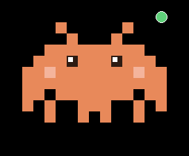
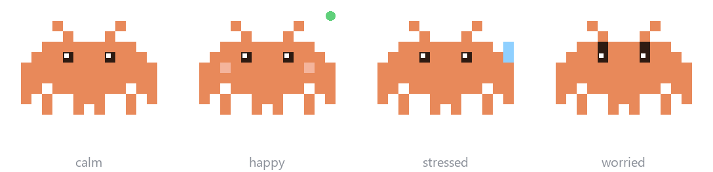

# Cloud Pet

**A pixel companion that lives on top of your screen, watches your laptop, and
keeps track of how long you spend talking to AI.**

<p align="center">
  
</p>

Nimbus floats above every window, bobs gently, blinks, and changes mood based on
what your machine is actually doing. Right-click it and it will answer a
question, research something on the web, set you a reminder, or take a note.

```
pythonw cloudpet.pyw
```

That is the whole install. **No `pip install`. No packages. Nothing to set up.**

---

## Zero dependencies, on purpose

The first version needed `psutil` and `PyGetWindow`. This one needs neither — it
asks Windows directly through `ctypes`:

| What it reads | Windows API |
|---|---|
| CPU load | `GetSystemTimes` |
| Memory pressure | `GlobalMemoryStatusEx` |
| Battery and charging | `GetSystemPowerStatus` |
| The focused window's title | `GetForegroundWindow` + `GetWindowTextW` |

If you have Python, you can run it. That matters more than it sounds: a desktop
toy that opens with a dependency error is a desktop toy nobody runs.

## Moods

The face is not decoration — every expression is a reading.



| Mood | What it means |
|---|---|
| **calm** | nothing to report |
| **happy**, pink cheeks | you are in an AI session, or it is thinking |
| **stressed**, sweat drops | CPU is over 80% |
| **worried**, raised brows | battery under 25% and not charging |

A green dot appears on its shoulder while a session is running.

## What "cloud sessions" actually measures

**Honest limitation, stated up front: this cannot read your Claude or ChatGPT
message counts.** There is no public API for consumer AI usage, so no tool can.

What it does instead is watch the title of whatever window is focused, and count
the seconds while that title contains one of these:

```python
"claude", "chatgpt", "gemini", "copilot",
"perplexity", "anthropic", "openai", "grok", "poe"
```

Browsers put the active tab's title in the window title, so reading this page in
a browser tab called "Claude" counts. It measures **focused time, not messages**
— a real proxy, not the real number. Edit `ai_keywords` at the top of
`cloudpet.pyw` to match the tools you actually use.

Double-click the pet for a readout: `cloud time 47m · cpu 12% · bat 88% · 6 projects`

## The rest of it

- **Ask AI / Research the web** — right-click, type a question. Uses a free
  Google Gemini key. "Research" turns on Google search grounding.
- **Reminders** — beeps and pops up when due, survives restarts.
- **Quick notes** — jot a line, timestamped, appended to a text file.
- **Projects folder** — point it at where you keep your work and it notices what
  you edited last: *"working on painpoint-finder ✏️"*
- **Lock screen**, open Claude.ai, open your notes.
- Drag it anywhere. It stays on top and remembers nothing it should not.

## Three boards

The pet watches the machine: CPU, memory, battery, the focused window. That
tells you what the laptop is doing, never what you are supposed to be doing.
So three more right-click items read your notes and your repos instead, and
each one answers a question rather than listing things:

- **What matters today** — reads the `Doing now` section of an Obsidian vault
  and ranks it P0 to P3 by how near the deadline is, because a date is the only
  thing on that list that cannot be moved by wanting it moved. **Each label
  holds exactly one item.** Four things marked P0 is a list again, so the
  nearest deadline takes the first free slot and the rest go under `then`.
  Disagree with it and pin: `board.py --pin P0 apisurface` holds it there, and
  the same pin again clears it.
- **Who hasn't replied** — counts the days since you sent each message, and
  says outright when it is still too early to read anything into a silence.
- **What I shipped** — commits per repo in the last seven days, from `git`.
  A week feels productive long after it stopped being one.

They run standalone too:

```
py -3 board.py            # add --json for machine-readable
py -3 outreach.py
py -3 ship.py
py -3 three.py            # all three panels at once
```

Point them at your own files with two environment variables:

```
setx PET_VAULT "C:\path\to\your\vault"
setx PET_CODE  "C:\path\to\your\repos"
```

`PET_VAULT` defaults to a `vault` folder next to the pet, so a fresh clone
reads nobody else's notes. When it is missing, the board says so and stops
rather than printing an empty day: unreadable and empty are different answers,
and only one of them means you have nothing to do.

## When Claude Code finishes

Claude Code runs long enough that you look away, and then one of two things
happens invisibly: it finishes, or it stops to ask you something and waits.
The second one is the expensive one. `hooks/claude_hook.py` writes a line per
event into `~/.claude/pet/inbox.jsonl` and Nimbus tails it, so it says
`apisurface done` or `cloud-pet asks` instead of you finding out ten minutes
later. **What Claude just did** in the right-click menu shows the last few,
with the bullet points from the session's closing summary.

Add it to `~/.claude/settings.json`, keeping any hooks already in the arrays:

```json
"hooks": {
  "Stop": [
    { "hooks": [{ "type": "command", "timeout": 10,
                  "command": "py -3 C:/path/to/cloud-pet/hooks/claude_hook.py done" }] }
  ],
  "PreToolUse": [
    { "matcher": "AskUserQuestion|ExitPlanMode",
      "hooks": [{ "type": "command", "timeout": 10,
                  "command": "py -3 C:/path/to/cloud-pet/hooks/claude_hook.py ask" }] }
  ]
}
```

Three things it is careful about, because a hook runs on the critical path of
every single turn:

- **It never fails a turn.** Every error is swallowed and the exit code is
  always 0. A pet that breaks your session is worse than no pet.
- **It redacts before writing.** A transcript quotes whatever you pasted into
  the session, and people paste API keys into sessions. Anything shaped like a
  credential is replaced before it reaches the file, let alone the screen.
- **It reads the tail, not the file.** Transcripts reach tens of megabytes.
  Reading 300 KB off the end keeps the hook near a second on a 24 MB session
  instead of putting real time on the end of every turn.

The pet reads from wherever it stopped last time, so an idle inbox costs one
`stat()` per tick. On startup it seeks to the end: a pet that boots and
announces every session you ran last week is not information.

## A detail worth stealing

Google renames and retires Gemini models regularly, which breaks anything with a
model name hardcoded in it. So before its first call the pet asks Google which
models the key can actually use, then scores them — prefer `flash`, prefer a
higher version number, avoid anything `exp`, `vision` or `tts` — and picks the
winner:

```python
def score(n):
    s = 0.0
    if "flash" in n: s += 10
    if "lite" in n:  s += 1
    mm = re.search(r"(\d+(?:\.\d+)?)", n)
    if mm: s += float(mm.group(1))
    if any(bad in n for bad in ("exp", "thinking", "vision", "tts", "image")):
        s -= 20
    return s
```

It falls back to a hardcoded name if that lookup fails. The pet outlives
Google's naming decisions.

## Privacy

Worth being blunt about, because it reads window titles:

- **Everything stays on your machine.** Titles are matched against the keyword
  list and thrown away. Only a running seconds count is stored.
- **Nothing is sent anywhere** unless you explicitly use Ask AI or Research —
  and then only your typed question goes to Google, never your window titles or
  your stats.
- **Your API key is stored in plain text** in `cloudpet_key.txt` next to the
  script. That is a real limitation, not a feature. It is in `.gitignore` so it
  cannot be committed by accident, but treat that file the way you would treat a
  password.
- Delete `cloudpet_data.json` to wipe your history. Right-click → *Reset today's
  count* clears the day.

## Install

1. **Python 3.9+** from [python.org](https://python.org) — tick *"Add Python to
   PATH"* during setup.
2. Download `cloudpet.pyw`.
3. Double-click it, or run `pythonw cloudpet.pyw`.

The `.pyw` extension is what stops a black console window appearing behind it.

**Optional, for the AI features:** get a free key from
[Google AI Studio](https://aistudio.google.com/apikey), then right-click the pet
→ *Settings* → *Set AI key*.

## Start it automatically at login

Task Scheduler, and one detail catches almost everyone:

1. Task Scheduler → **Create Task** (not *Basic Task*).
2. **General** tab → select **"Run only when user is logged on"**. Anything else
   runs it invisibly, where you will never see it.
3. **Triggers** → New → *At log on*.
4. **Actions** → New:
   - **Program/script**: the full path to `pythonw.exe`, not just `pythonw`.
     Find it by running `where pythonw` in a Command Prompt.
   - **Add arguments**: `"C:\path\to\cloudpet.pyw"` — with the quotes.

Task Scheduler does not search the same places your Command Prompt does, so the
bare name `pythonw` often resolves fine when you test it and fails silently when
the task runs. The full path fixes it.

## Windows only, honestly

The float-with-no-box effect uses Tk's `-transparentcolor`, which only exists on
Windows. On macOS and Linux the code runs, but the pet sits inside a grey
rectangle and the system stats read zero — the `ctypes` calls are Windows APIs.
Making it cross-platform means a second backend for stats and a different
transparency approach.

## Tweaking

Everything adjustable lives in the `CONFIG` block at the top of the file:

```python
"cpu_stress_threshold": 80,      # when it starts sweating
"battery_low_threshold": 25,     # when it starts worrying
"pixel": 8,                      # pet size
"bob_speed_ms": 90,              # animation speed
```

The pet itself is a 13×9 ASCII grid — edit `INVADER` to redraw it entirely.

## Licence

MIT. See [LICENSE](LICENSE).
